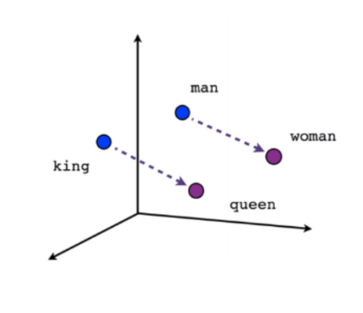
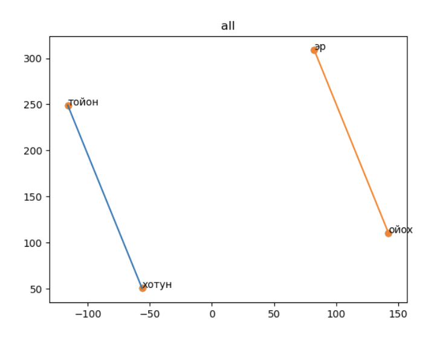

# Sakha Languag Embeddings

Набор методов для формирования корпуса Якутского языка и обучению Gensim word2vec модели 

Обученные модели можно использовать для решения множества задач, т.к. векторные представления слов открывают возомжности применять классические алгоритмы ML для текста.

Некоторые примеры вы можете найти в директории scripts, также есть пример в [этом](https://github.com/nlp-sakha/site) репозитории






### Формирование корпуса и обучение модели посредством Docker

1. Устанавливаем docker по инструкции https://www.docker.com/get-started;
2. Заходим в корневую папку репозитория;
3. Собираем образ в соответствии с Dockerfile следующей командой:
```docker build -t sakha ./```;
4. Запускаем Docker образ: ```docker run -v $PWD:/project/ -it sakha```, после данного шага откроется терминал
внутри docker котнейнера;
5. Заходим в папку проекта ```cd project```
6. Если нет файла с корпусом, то запускаем скрипт для формирования корпуса ```./get_data.sh``` 
(! предварительно в скрипте стоит поменять значения аргументов -f -t на более актуальные, т.к. они отвечают за диапозон статей который будет парсится). 
Скрипт get_data.sh скачивает актуальный стейт якутской википедии и парсит некоторые онлайн издания на якутском языке
7. Обучаем модель запустив скрипт train.sh следующей командой: ```train.sh```
8. Обученная модель будет находиться в папке vectors с дефолтным названием model.bin

### План развития:

На текущий момент представлен только один вид вложения слов в векторные пространства - word2vec. 
Будет правильным получить реализации многих других популярных методов, например fastText и GloVe.

Необходимо также пополнять копилку проектов в рамках которых эти модели используются. 

### Как можно поучаствовать в проекте

1. Любые проблемы с которыми вы сталкиваетесь в процессе использования данного проекта можно и нужно описывать в 
разделе Issues, это позволит разработчикам получать обратную связь и быть в курсе проблем которые стоит исправить;
2. Реализация моделей новых алгоритмов embeddings;  
3. Написание парсеров других источников контента на якутском языке позволит сформировать более полноценный корпус;
4. Т.к. нет явных метрик по которым можно оценить качество модели, стоит пополнять набор кейсов, по которым мы сможем 
понимать как влияют те или иные правки на качество модели.